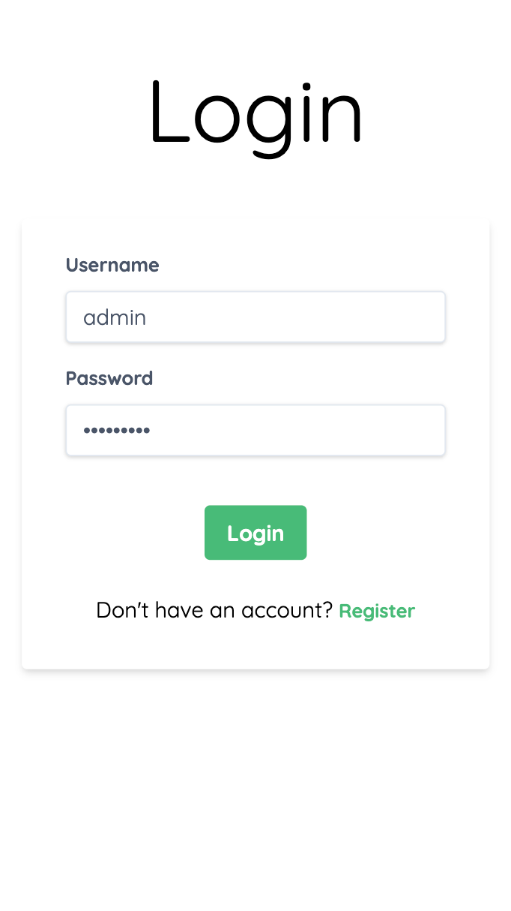
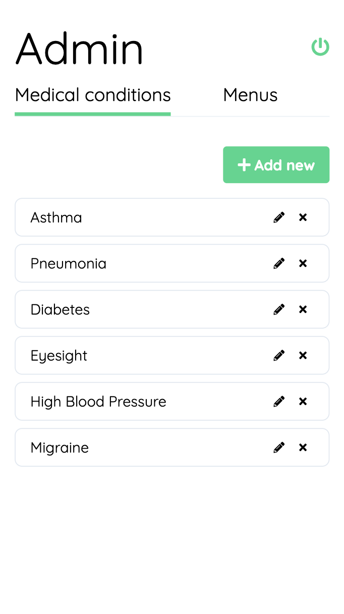
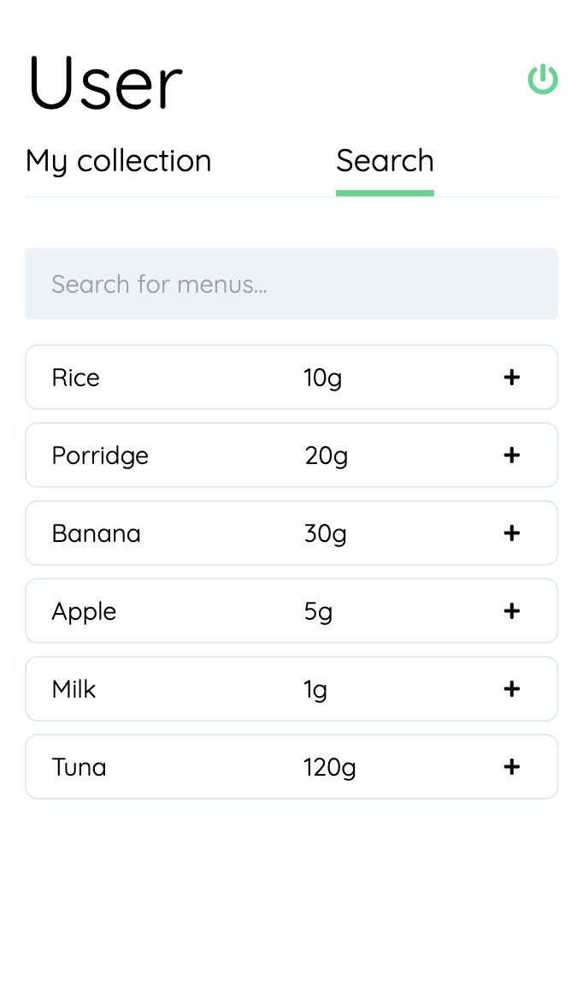

# Installation

### 1. Back-end
Install dependencies
```bash
cd <path-to-back-end>
npm install
```
Migrate & seed
```bash
node_modules/.bin/sequelize db:migrate
node_modules/.bin/sequelize db:seed:all
```
Run back-end
```bash
DEBUG=frl-health-app:* npm start
```

### 2. Front-end
Install dependencies
```bash
cd <path-to-front-end>
npm install
```
Run front-end
```bash
npm start
```


# Usage

Open: http://localhost:3100

Admin user: `admin` / `admin@123`

Demo user: `demo` / `demo@123`

# Screenshots

 

 

 

 